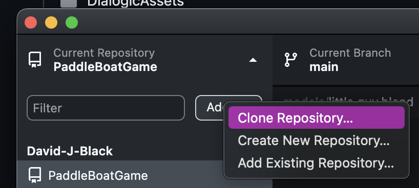
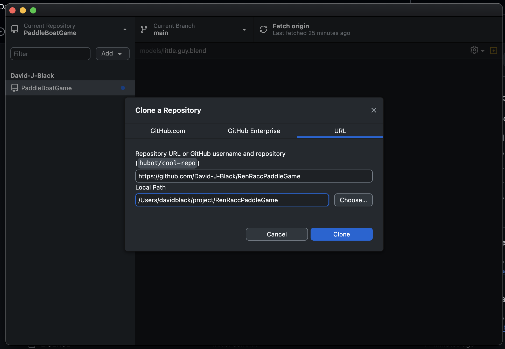
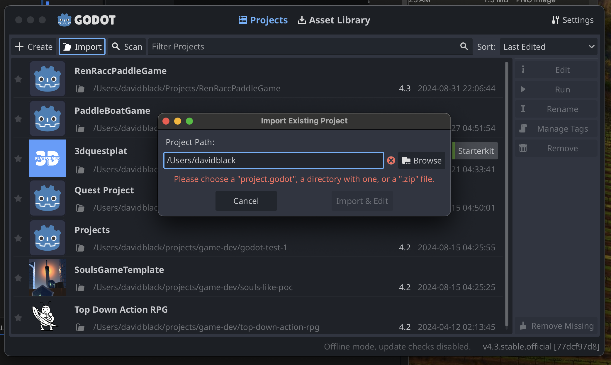
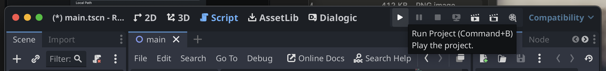
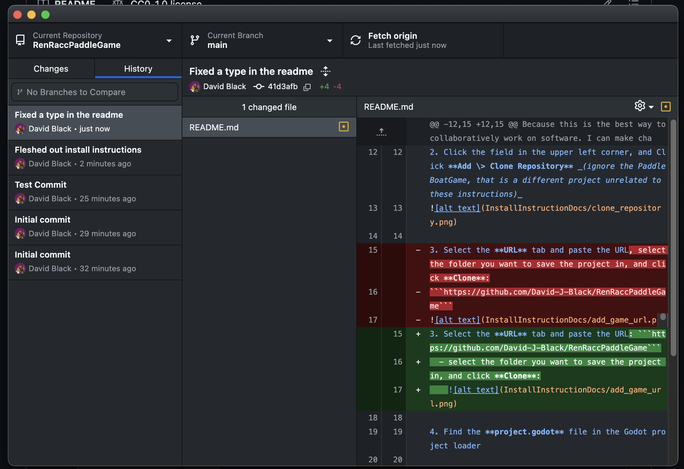

# The Ren Racc Paddle Project

I need to add more text here someday, especially if we want to throw more collaborators on willy nilly style.

## PaddleBoat, Why the fuck are we using github?

Because this is the best way to collaboratively work on software. I can make changes and send them to your project incredibly easy, and you can do so with me

## How Do I install this project?

1. Open Github Desktop Client
2. Click the field in the upper left corner, and Click **Add \> Clone Repository** _(ignore the PaddleBoatGame, that is a different project unrelated to these instructions)_


3. Select the **URL** tab and paste the URL: ```https://github.com/David-J-Black/RenRaccPaddleGame```
  - select the folder you want to save the project in, and click **Clone**:
    

4. Find the **project.godot** file in the Godot project loader



5. If you want to run the game, hit the **Run Project** button 😏



Now you have a copy of the project that keeps track of your changes If you want to send your changes to the main codebase (or to a personal branch you can make where you can make changes that don't affect the main branch that everyone else has their project set to)

### I highly recommend looking up how to

- Commit code via github client
- Push code to a branch (Your project starts out pushing to main, and I think it's actually a good idea while we are a small team, to push to main 😉)
- Change Branches
- Pull commits from remote (AKA: Downloading changes other people made)
  - When you download other people's changes, there is an interface for clicking and choosing conflicting changes (AKA Files that were touched that you also made change to). I swear this stuff will be less intimidating as soon as you get it going.

having a project in git is like quicksaving in Skyrim. When you commit code, you are saving a version of the project permanently. If you fuck up really bad, you can restore your project to a commit. It's incredible, this shit will change your life IDK.

You can see the history of who's changed one in the history tab

